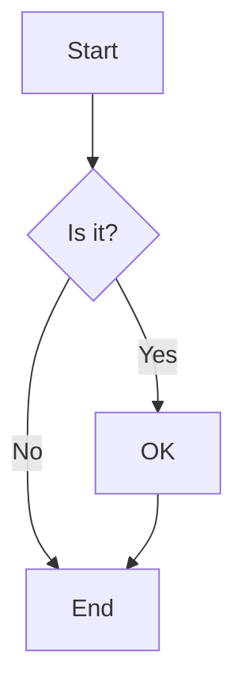

# MermaidMono

A simple tool to visualize mermaid diagrams and export them as SVG or PNG files.

## Features

- Real-time mermaid diagram rendering
- Export diagrams as SVG or PNG images
- Clean black and white design
- Monospace typography throughout
- Paste from clipboard functionality
- Error handling for invalid syntax

## Getting Started

First, install dependencies:

```bash
npm install
```

Then, run the development server:

```bash
npm run dev
```

Open [http://localhost:3000](http://localhost:3000) with your browser to see the application.

## Usage

1. Enter or paste your mermaid diagram code in the left panel
2. See the live preview in the right panel
3. Click "SVG" or "PNG" to export your diagram in your preferred format
4. Use the "PASTE" button to quickly insert code from your clipboard

**Export Formats:**
- **SVG** - Vector format with perfect quality and no text cutoff (recommended)
- **PNG** - Raster format at 3x resolution for high quality

## Built With

- [Next.js](https://nextjs.org/) - React framework
- [Mermaid](https://mermaid.js.org/) - Diagram and chart tool
- [html-to-image](https://github.com/bubkoo/html-to-image) - PNG export functionality
- [Tailwind CSS](https://tailwindcss.com/) - Styling

## Example Mermaid Code



## License

MIT
